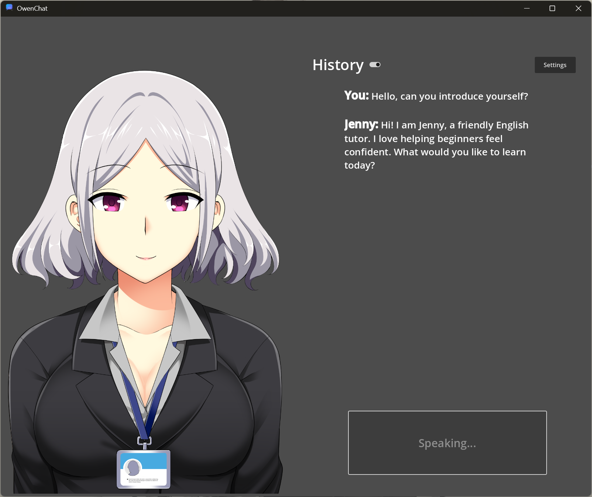
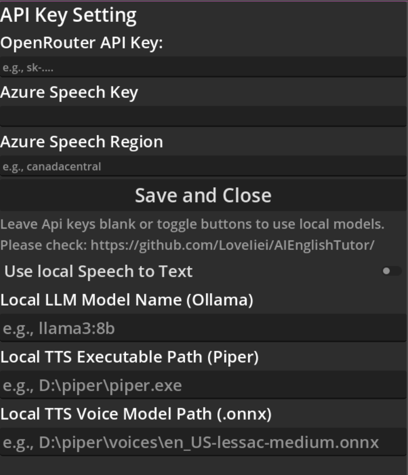

# AI English Tutor

Welcome to the AI English Tutor, a desktop application built with Godot and C# that allows you to practice your English in spoken conversations with a friendly and expressive AI companion. This project is built for ultimate flexibility, featuring a powerful dual-mode AI engine that can run entirely on your local machine or connect to cloud-based APIs.



## ✨ Features

*   **Practice with an Animated Character:** Have a conversation with Jenny, a cute and expressive anime character who provides clear visual feedback with `idle`, `listening`, and `talking` animation states.

*   **Stateful AI with Conversation Memory:** The AI is no longer a goldfish! It now remembers the entire conversation history, allowing for much more complex, natural, and context-aware interactions that evolve over time.

*   **Advanced, Swappable AI Personas:** Choose the AI's personality from the settings menu to tailor your learning experience:
    *   **Simple English Tutor:** A friendly persona that provides gentle grammatical corrections in context and maintains a natural conversational flow.
    *   **Multi-Mode IELTS Tutor:** A structured examiner that guides you through distinct practice modules for `Speaking`, `Vocabulary`, and `Listening`.

*   **Hybrid AI Engine (Cloud & Local):** You have complete control over the AI backend.
    *   ✅ **Local Mode (Recommended):**
        *   **LLM:** [Ollama](https://ollama.com/) (with dynamic model selection).
        *   **STT:** [Whisper.cpp](https://github.com/ggerganov/whisper.cpp) (with automatic server management).
        *   **TTS:** [Piper](https://github.com/rhasspy/piper) (with real-time speaking rate control).
    *   ✅ **Cloud Mode (Fallback):**
        *   **LLM:** [OpenRouter](https://openrouter.ai/)
        *   **STT/TTS:** [Microsoft Azure Speech](https://azure.microsoft.com/en-us/products/ai-services/speech-to-text) (with improved silence detection).

*   **Seamless User Experience:**
    *   **Live Settings Reload:** All configuration changes are applied **instantly**—no restart required!
    *   **Automatic Server Management:** If local STT is configured, the app automatically launches and manages the `whisper-server.exe` process in the background and ensures it's terminated on exit.
    *   **Real-Time Speaking Rate Control:** A slider on the main UI allows for instant, interactive control over the AI's voice speed.
    *   **On-Screen History:** A toggleable conversation log lets you review your practice session.

*   **Secure "Bring Your Own Key/Path" Model:** No API keys or personal paths are hardcoded. All user-provided information is saved securely in the `user://` directory, keeping it separate from the project and Git repository.

*   **Cross-Platform:** Built in Godot, with platform-specific configurations (like macOS microphone permissions) and professional process management to ensure it runs reliably on both Windows and Mac.

## 🛠️ Tech Stack

*   **Game Engine:** Godot 4 (with .NET/C#)
*   **Local LLM Server:** [Ollama](https://ollama.com/)
*   **Local STT Server:** [Whisper.cpp](https://github.com/ggerganov/whisper.cpp)
*   **Local TTS Engine:** [Piper](https://github.com/rhasspy/piper)
*   **Cloud LLM Service:** OpenRouter (OpenAI-compatible API)
*   **Cloud Speech Service:** Microsoft Azure Cognitive Services for Speech
*   **Language:** C#

## 🖥️ Local AI Backend Setup (Optional)

To run the application in its most powerful, fully offline mode, you must set up the following local AI services.

#### 1. LLM (Ollama)
The app uses [Ollama](https://ollama.com/) to run local Large Language Models.
*   **Installation:** Download and install Ollama for your OS.
*   **Download a Model:** Pull a model from the Ollama library. We recommend starting with `Llama 3.1 8B`.
    ```bash
    ollama pull llama3.1:8b
    ```
*   **Running:** The Ollama background service is all that's needed. The app will automatically detect your downloaded models and show them in the settings panel dropdown.

#### 2. Speech-to-Text (Whisper.cpp)
The app connects to a [Whisper.cpp](https://github.com/ggerganov/whisper.cpp) server for local transcription.
*   **Installation:** Download the appropriate pre-built binary from the [Whisper.cpp releases page](https://github.com/ggerganov/whisper.cpp/releases).
    *   For **NVIDIA GPU** users on Windows (recommended): Download `whisper-cublas-....zip`.
    *   For **CPU-only** on Windows: Download `whisper-bin-x64.zip`.
    *   For **MAC**: Download `whisper-{version}-xcframework.zip`
*   **Download a Model:** Download a quantized Whisper model. `ggml-base.en-q8_0.bin` is a fast, high-quality starting point from [Huggingface](https://huggingface.co/ggerganov/whisper.cpp/tree/main)
*   **Configuration:** You will provide the path to `whisper-server.exe` and the `.bin` model file in the app's settings panel. The app will launch and manage the server for you.

#### 3. Text-to-Speech (Piper)
The app calls the [Piper](https://github.com/rhasspy/piper) executable directly for local voice synthesis.
*   **Installation:** Download Piper from the [Piper releases page](https://github.com/rhasspy/piper/releases). Note: `piper_windows_amd64.zip` works for both AMD and Intel CPUs.
*   **Download a Voice:** Download a voice model from the [official Piper voices page](https://huggingface.co/rhasspy/piper-voices/tree/main). You will need both the `.onnx` and `.onnx.json` files for your chosen voice.
*   **Configuration:** You will provide the path to `piper.exe` and the `.onnx` voice file in the app's settings panel.

## 🚀 Getting Started & Configuration

1.  Launch the application.
2.  Click the **"Settings"** button to open the configuration panel.
3.  Configure your desired modes:
    *   **To use Local Mode:** Fill in the paths and model names for your local Ollama, Whisper, and Piper setup.
    *   **To use Cloud Mode:** Leave the local path fields blank and enter your API keys for OpenRouter and Azure.
4.  Click **"Save and Close"**. Settings are applied **instantly**—no restart required!
5.  Press and hold the "Hold to Talk" button to start a conversation.



## Contribution
Any PRs and suggestions are welcomed!

## Credit
A huge thank you to **sutemo** for creating the amazing and cute character sprite used for Jenny! Please find the original work and support the artist at their page: [https://sutemo.itch.io/female-mature-anime-sprite](https://sutemo.itch.io/female-mature-anime-sprite)
