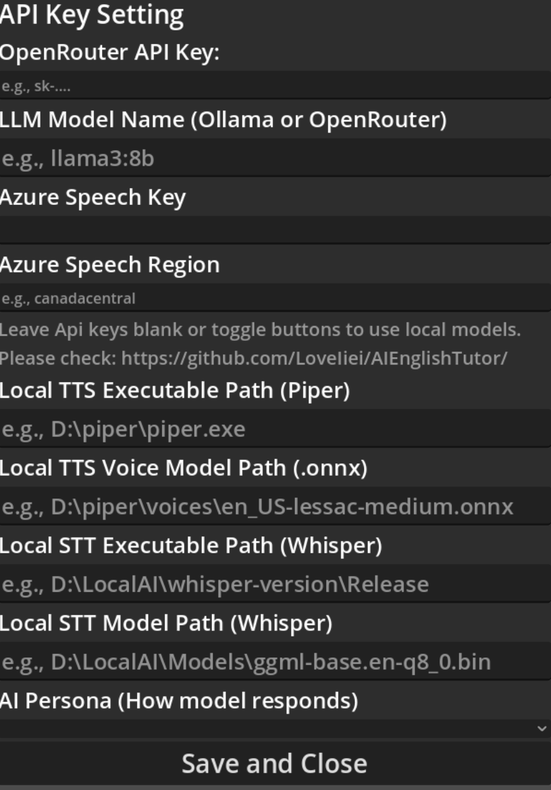

# AI English Tutor

This is the initial release of the AI English Tutor, a desktop application built with Godot and C# that allows users to have spoken conversations with an animated AI character. The project is designed for flexibility, supporting both powerful local LLMs and cloud-based APIs.

## ✨ Features

*   **Interactive Voice Conversations:** Engage in real-time, spoken conversations. The app uses Microsoft Azure for high-quality Speech-to-Text and Text-to-Speech services.

*   **Animated 2D Character:** The tutor is represented by an animated character with `idle`, `listening`, and `talking` states for clear visual feedback.

*   **Hybrid AI Engine (Cloud & Local):** You have complete control over the AI backend.
    *   ✅ **Local Mode (Default):**
        *   **LLM:** [Ollama](https://ollama.com/)
        *   **STT:** [Whisper.cpp](https://github.com/ggerganov/whisper.cpp)
        *   **TTS:** [Piper](https://github.com/rhasspy/piper)
    *   ✅ **Cloud Mode (Fallback):**
        *   **LLM:** [OpenRouter](https://openrouter.ai/)
        *   **STT/TTS:** [Microsoft Azure Speech](https://azure.microsoft.com/en-us/products/ai-services/speech-to-text)

*   **On-Screen UI:**
    *   A **conversation history log** lets you review your and the AI's responses.
    *   A **"Show History"** checkbox to toggle the log's visibility.
    *   A **Settings Panel** to securely manage API keys and app preferences.

*   **Customizable AI Persona:** The AI's personality is defined by a detailed **system prompt**, instructing it to act as a friendly, encouraging, and simple English tutor. Model parameters like `temperature` and `max_tokens` are also configured for optimal performance.

*   **Secure "Bring Your Own Key" Model:** No API keys are hardcoded. All keys are saved securely in the `user://` directory, which is kept separate from the project and Git repository.

*   **Cross-Platform:** Built in Godot, with platform-specific configurations (like macOS microphone permissions) to ensure it runs on both Windows and Mac.

## 🛠️ Tech Stack

*   **Game Engine:** Godot 4 (with .NET/C#)
*   **Local LLM Server:** Ollama
*   **Cloud LLM Service:** OpenRouter (OpenAI-compatible API)
*   **Speech Services:** Microsoft Azure Cognitive Services for Speech
*   **Language:** C#

## 🚀 Getting Started

1.  **(For Local Mode)** Ensure [Ollama](https://ollama.com/) is installed and running a model in the terminal (e.g., `ollama run llama3:8b`).
2. **(For Local Mode)** Piper and Whisper are used for TTS and STT services, please install the correct versions:  
[Whisper](https://github.com/ggml-org/whisper.cpp/releases):
* Install the whisper-cublas-12.4.0-bin-x64.zip if you have Nvidia GPU
* Install the whisper-bin-x64.zip if you only want to run on CPU on Windows, whisper-blas-bin-x64.zip is also CPU only, but faster
* Install whisper-v1.7.6-xcframework.zip for macOS  
[Piper](https://github.com/rhasspy/piper/releases):  
* Please install the correct version for your platform.
3.  Launch the application.
4.  Click the **"Settings"** button.
5.  **To use Local Mode:** Check the "Prioritize Local Model" box and click "Save".
6.  **To use Cloud Mode:** Uncheck the local model box and enter your OpenRouter and Azure API keys, then click "Save".
7.  **Restart the application** for the new settings to take effect.
8.  Press and hold the "Hold to Talk" button to start a conversation!

## Configurations:
After opening the app, you can click on the Settings button at the top right corner.
In there, you can see a page like this:

If you want to use online services like OpenRouter, then you need to fill in your own API keys. Same applies to Azure Speech Service

If you have set up your Local Ollama+Whisper+Piper, then:  
1. You need specify the model name you want to use with Ollama, make sure you already installed the model locally, if any error happens, please try running `ollama pull {modelname}`
2. You need to specify the full path to your piper.exe, e.g C:/Users/{username}Downloads/piper.exe (this last part is needed)
3. You need to specify the full path to your voices to be used for piper, I recommend putting it together with piper.exe, so e.g., {piper.exe path}/voices/{voicename.onnx}

## Contribution:
Any PRs and suggestions are welcomed!

## Credit:
Thanks for sutemo creating such an amazing character sprite, please find the original work and support him/her at https://sutemo.itch.io/female-mature-anime-sprite
